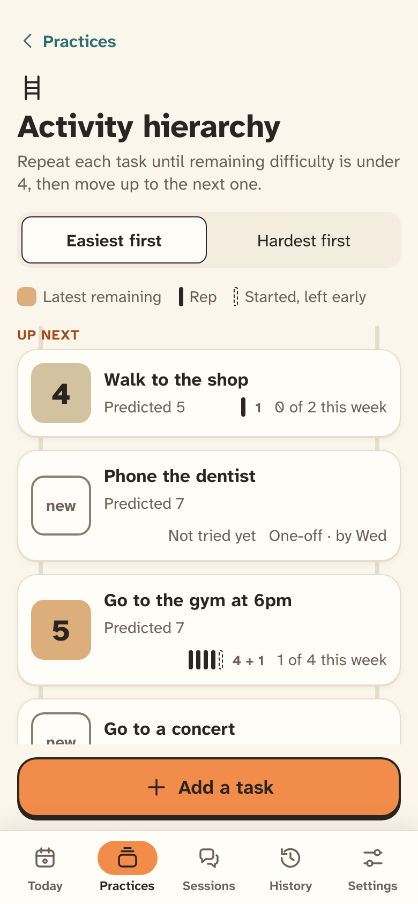
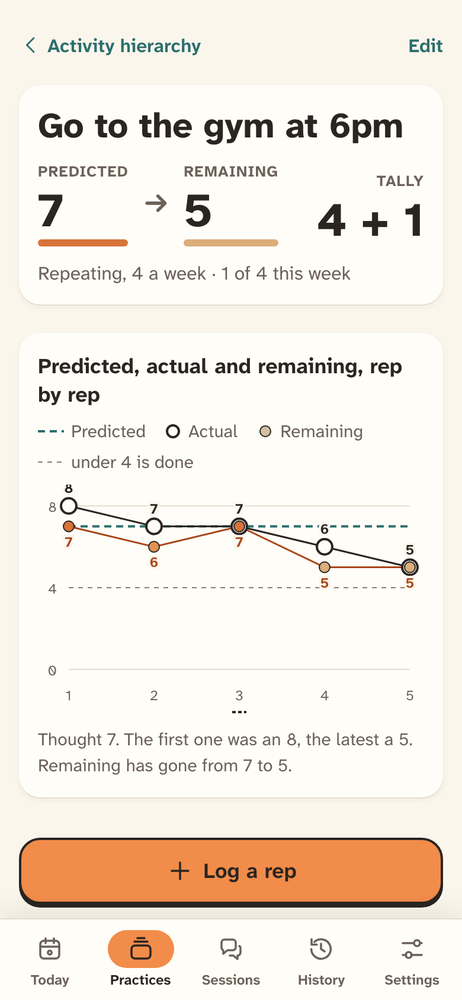
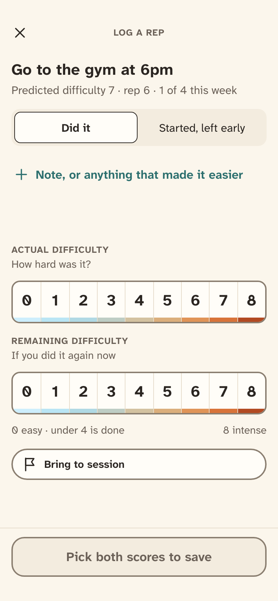
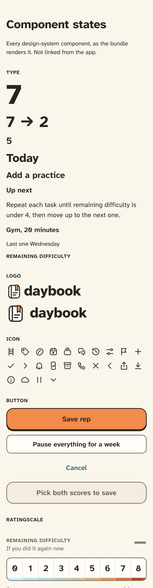
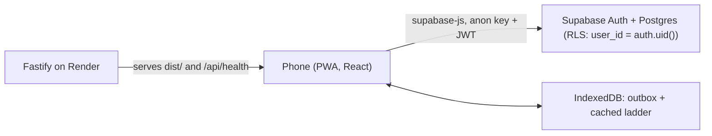

# Daybook

A phone-first, offline-capable PWA for tracking therapy homework and practice between sessions, built design system first.

[](https://github.com/waq-b/daybook/actions/workflows/ci.yml)

<p>
  
  
  
</p>

_The app running at 390px, rendered against a mocked backend with sample data (the same setup the end-to-end tests use)._

**Live:** https://daybook-gjf6.onrender.com (free Render tier, so the first request after idle can take up to a minute). Accounts are created by the author, so you can open the sign-in page but not go further.

**Status: in progress.** Foundation, sessions and the activity hierarchy are built and deployed. See [Roadmap](#roadmap).

## Why

Between therapy sessions, homework often lives on paper worksheets: a task, a predicted difficulty, a tally of repetitions, the difficulty remaining afterwards. Daybook puts that worksheet on a phone so a repetition can be logged on the spot, with no signal, and brought to the next session. It is a logbook, not a coach: it gives no advice or interpretation, and a missed day is not framed as a failure.

It is not a medical device or a substitute for professional care.

## Features (built)

- **Email-code sign-in** (Supabase Auth, existing accounts only: the client sets `shouldCreateUser: false`), and an install guide for iOS and Android.
- **Activity hierarchy:** practices, each a ladder of tasks ordered easiest first or hardest first. Add and edit tasks; a task page shows predicted vs remaining difficulty, a tally and a chart.
- **Log a rep:** actual and remaining difficulty (0 to 8), "started, left early" attempts, quick-pick notes, an optional prediction check, and a flag to bring it to session. A half-filled entry survives the app closing.
- **Sessions:** list, add and edit, detail with notes, mark as done, and link practices assigned in a session.
- **Offline logging:** writes are saved on the phone and synced later; the ladder is cached so it opens without a connection.
- **Settings:** export everything as JSON, and a two-step "delete everything".

## Design

The design system came first: tokens, a self-hosted accessible typeface (Atkinson Hyperlegible Next) and 16 components, vendored in [`design/`](design/). The app mounts them as they are rather than re-implementing them, and [`docs/DESIGN.md`](docs/DESIGN.md) records how, plus the accepted deviations. A token check fails the build if a component reads an undefined CSS variable, and ESLint and stylelint ban hex colours outside `design/`.

<p>
  
</p>

_Design: the design-system components as rendered by the app's `/dev/states` page (the top of it)._

## Architecture



The server is deliberately thin. Reads and writes go from the client to Supabase under row level security. "Export everything" and "delete everything" are Postgres functions called over RPC, so no service key lives on the server. Only the publishable (public) key ships in the app.

## Stack

| Layer         | Choice                                                                |
| ------------- | --------------------------------------------------------------------- |
| Frontend      | React 18, Vite, TypeScript, React Router 7, `vite-plugin-pwa`         |
| Offline       | IndexedDB outbox via `idb`                                            |
| Server / host | Fastify 5 on Node 22 (serves the built app and `/api/health`), Render |
| Data          | Supabase Postgres, Auth and row level security                        |
| Tests         | Vitest, Playwright (Chromium and WebKit), axe, Lighthouse CI          |

## Run it locally

Needs Node 22 (see `.nvmrc`) and a Supabase project; the app throws at start-up without `VITE_SUPABASE_URL` and `VITE_SUPABASE_PUBLISHABLE_KEY`. There is no stub mode for the app itself, but:

- `/dev/states` renders every component and state without signing in (any placeholder values in `.env` will do), and
- the end-to-end tests run the whole app against a mocked Supabase, so you can try everything without keys.

```bash
cp .env.example .env     # see the comments in the file
npm ci
npm run dev              # http://localhost:5173 (try /dev/states)
npm run dev:server       # API on http://localhost:3000
```

To use a real backend, apply `supabase/migrations/` in order to a Supabase project. Production-style: `npm run build && npm start`.

## Tests and CI

```bash
npm run typecheck && npm run lint && npm run format:check
npm test             # 536 unit tests: rules, voice, tokens, outbox, PWA
npm run test:db      # 77 database tests (needs TEST_DATABASE_URL, a Postgres)
npm run e2e:build && npm run e2e   # 232 e2e tests, Android Chrome and iPhone WebKit profiles
npm run lighthouse   # accessibility score of at least 0.95
npm run check:update # a new version reaches an already-open app
```

[`ci.yml`](.github/workflows/ci.yml) runs all of these plus the build on every PR. [`live.yml`](.github/workflows/live.yml) runs a smoke suite against the deployed site after each deploy (it needs the author's Supabase secrets, so it is only meaningful in the original repo); [`keep-awake.yml`](.github/workflows/keep-awake.yml) pings Supabase every three days so the free project does not pause. [`docs/checks.md`](docs/checks.md) maps each former manual check to its test.

## Design decisions worth noting

- **Voice is enforced by tests.** Every user-facing string lives in `src/copy.ts`. A unit test (`src/copy.test.ts`, built on `src/voice.ts`) fails on exclamation marks, emoji and banned words, and an ESLint rule (`react/jsx-no-literals`, plus a ban on literal `aria-label`, `title`, `placeholder` and similar attributes) stops strings appearing in components.
- **Row level security tested against real Postgres.** Every table has `user_id` and RLS from the first migration, with no DELETE grant at all. `npm run test:db` creates a fresh database per test file, applies the migrations on top of a small Supabase stub, and runs SQL as a given user with the role and JWT claims PostgREST sets. CI runs it against a Postgres 17 service container.
- **Offline writes that cannot duplicate.** Each entry gets its ID on the phone and syncing is an upsert on that ID, so retries are safe. Edits to a row still waiting are folded into the queued write. Sync runs on open, on reconnect and on return to the app, since iOS has no Background Sync.
- **PWA and accessibility are CI gates.** Playwright checks installability and opening offline, and the e2e suite also runs on an iPhone WebKit profile. axe runs over the screens and states at 390px and at 200% text, and Lighthouse CI requires an accessibility score of at least 0.95 (on the sign-in page and `/dev/states`).
- **`main` only changes through PRs.** A pre-push hook (`scripts/refuse-push-to-main.mjs`, installed by `simple-git-hooks` on `npm ci`) refuses direct pushes to `main`. It is a client-side guard, so it complements rather than replaces GitHub branch protection.
- **Deploys are verified.** `/api/health` reports the deployed commit, and a post-deploy workflow waits for Render to serve that commit before running the live suite.

## Roadmap

Built: foundation (0a), sessions (0b), activity hierarchy (0c). Designed but not built: Today and missed-target prompts, flags and "prepare for session", reminders and web push, feelings and gratitude practices, tablet layout, PDF export of the worksheet. [`CHANGELOG.md`](CHANGELOG.md) lists what has shipped.

## Docs

- [`docs/DESIGN.md`](docs/DESIGN.md): how the design system is applied
- [`docs/checks.md`](docs/checks.md): what the automated checks cover
- [`design/README.md`](design/README.md): the design system's own principles and voice
- [`CHANGELOG.md`](CHANGELOG.md)

## Licence

MIT, see [`LICENSE`](LICENSE).
